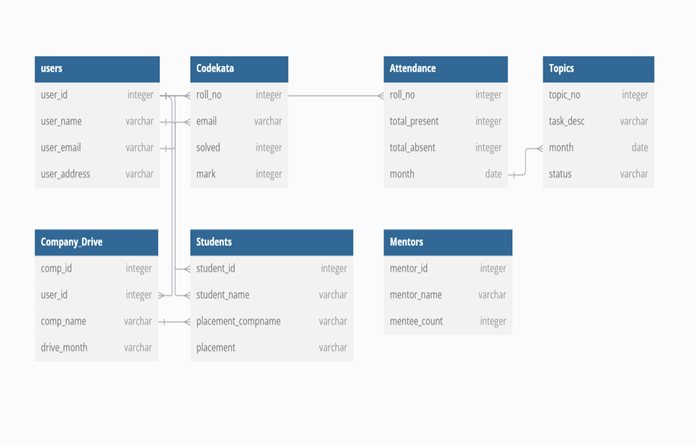
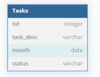
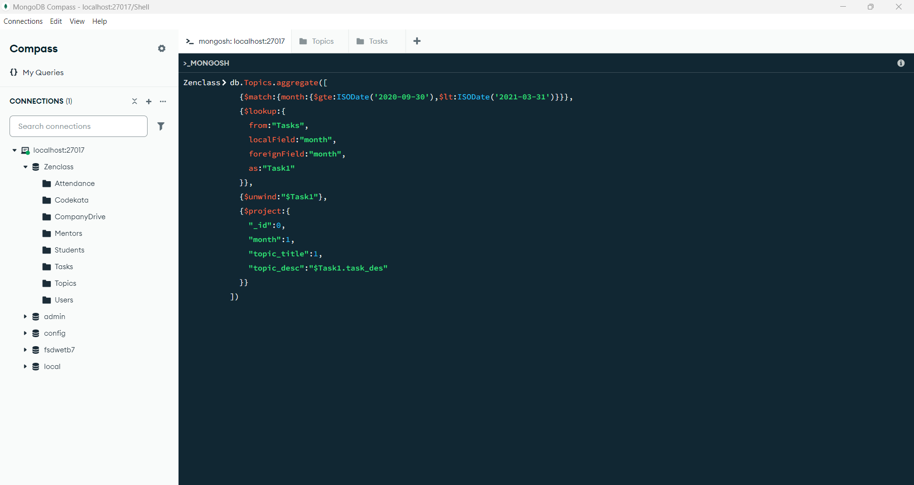
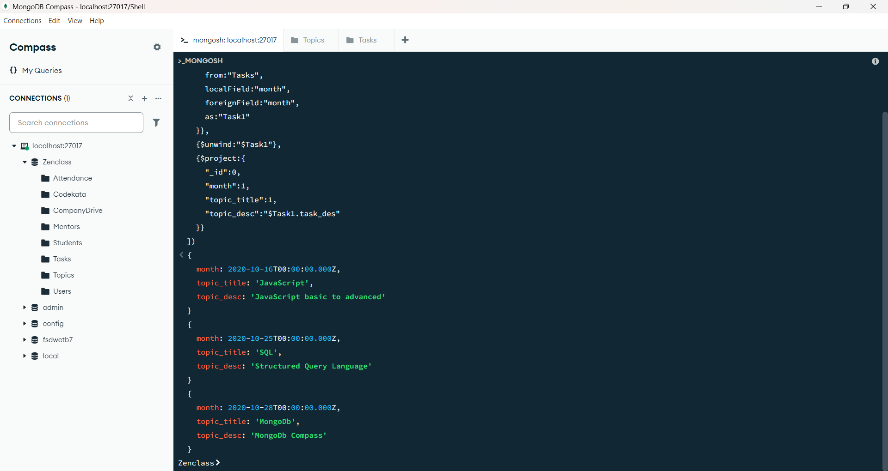
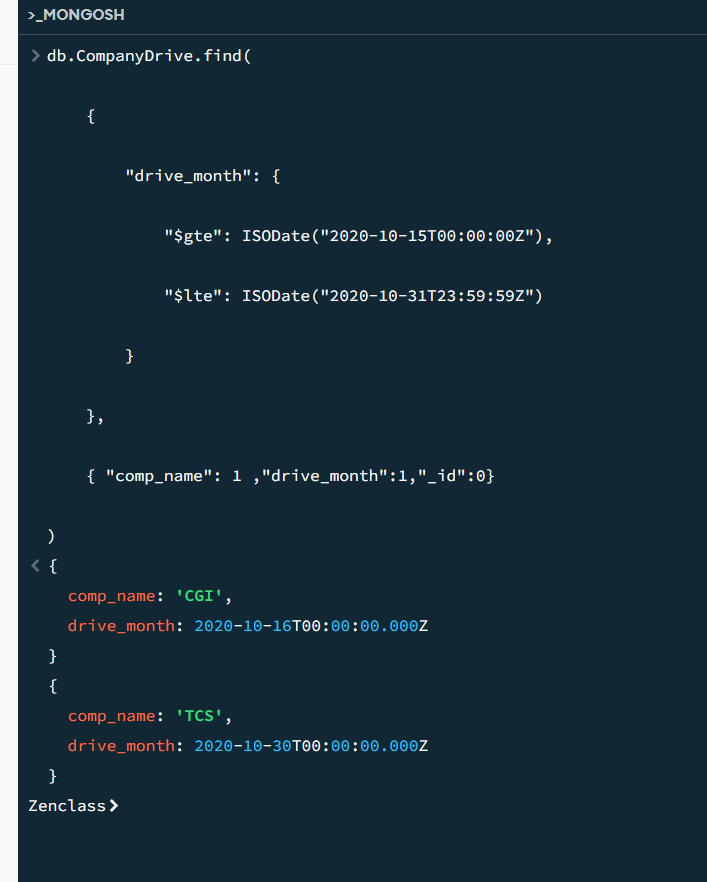
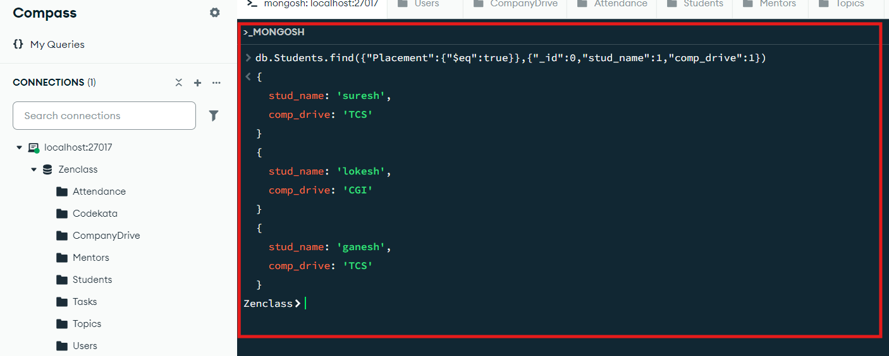
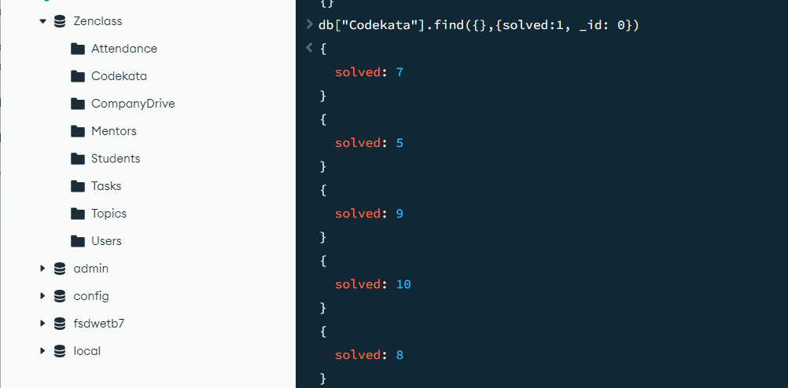
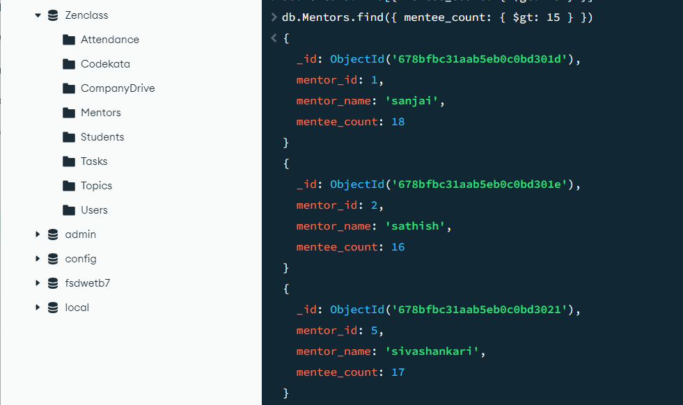
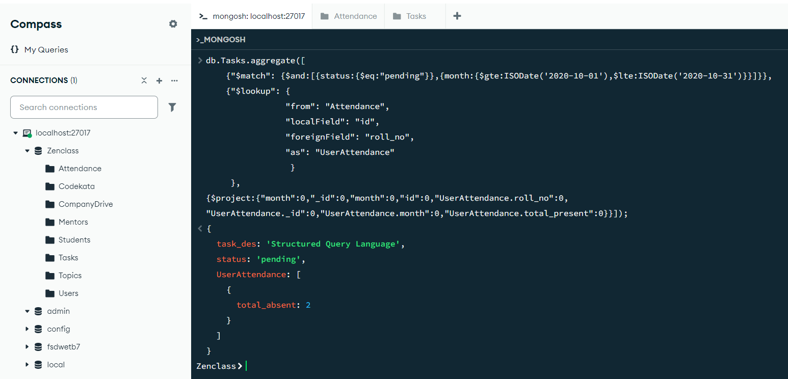
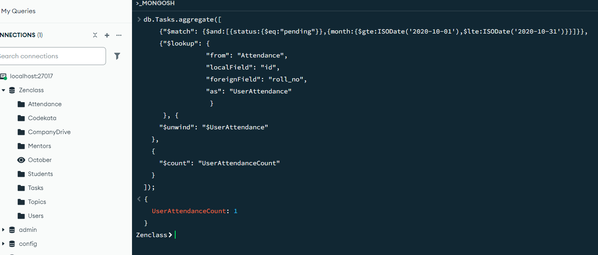

                                                          DB Model Design
                                            Application:ZenClass Programme
---Features:

# Users :
o User_id
o Name
o Email
o Address
# Codekata :
o RollNo
o Email
o Problem_Solved
o Mark
# Attendance
o RollNo
o No. of . days Present
o No. of . days Absent
o Month
# Topics:
o Topic_No
o Topic_Name
o Month
o Status

## Tasks:
o Task_Id
o Task Details
o Month
o Status

## Company_Drives:
o Company_Id
o User_id
o Company Name
o Drive_Month
## Students:
o Student_Id
o Student_Name
o Company Name
o Placement
## Mentors:
o Mentor_Id
o Mentor_Name
o Mentee’s Count
Relationships:

### Query:

1. Find all the topics and tasks which are thought in the month of October

   db.Topics.ggregate([
   {$match:{month:{$gte:ISODate('2020-10-01'),$lte:ISODate('2020-10-31')}}},
   {$lookup:{
   from:"Tasks",
   localField:"month",
   foreignField:"month",
   as:"Task1"
   }},
   {$unwind:$Task1"},
   {$project:{
   "_id":0,"month":1,"topic_title":1,"topic_desc":"$Task1.task_des"}}])

   
   

2. Find all the company drives which appeared between 15 oct-2020 and 31-oct-2020

    db.CompanyDrive.find({"drive_month":{"$gte":ISODate("2020-10-15T00:00:00Z"),
    "$lte":ISODate("2020-10-31T00:00:00Z")}},{"comp_name":1,"drive_month":1,"_id":0})

    

3. Find all the company drives and students who are appeared for the placement.

   db.Students.find({"Placement":{"$eq":true}},{"_id":0,"stud_name":1,"comp_drive":1})

   

4. Find the number of problems solved by the user in codekata
   
   db.[“Codekata”].find({},{solved:1,_id:0})

   

5. Find all the mentors with who has the mentee's count more than 15

db.Mentors.find({mentee_count:{$gt : 15}})

6. Find the number of users who are absent and task is not submitted between 15 oct-2020 and 31-oct-2020

db.Tasks.aggregate([
{"$match": {$and:[{status:{$eq:"pending"}},{month:{$gte:ISODate('2020-10-01'),$lte:ISODate('2020-10-31')}}]}},
{"$lookup": {
                "from": "Attendance", 
                "localField": "id", 
                "foreignField": "roll_no", 
                "as": "UserAttendance"
                 }
     },
{$project:{"month":0,"_id":0,"month":0,
"UserAttendance._id":0,"UserAttendance.month":0,"UserAttendance.total_present":0}}]);

To find the Count:

db.Tasks.aggregate([
{"$match": {$and:[{status:{$eq:"pending"}},{month:{$gte:ISODate('2020-10-01'),$lte:ISODate('2020-10-31')}}]}},
{"$lookup": {
                "from": "Attendance", 
                "localField": "id", 
                "foreignField": "roll_no", 
                "as": "UserAttendance"
                 }
     },
{$project:{"month":0,"_id":0,"month":0,
"UserAttendance._id":0,"UserAttendance.month":0,"UserAttendance.total_present":0}}]);

